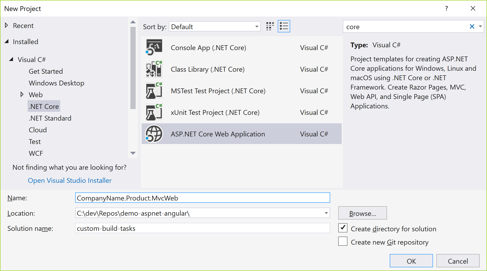
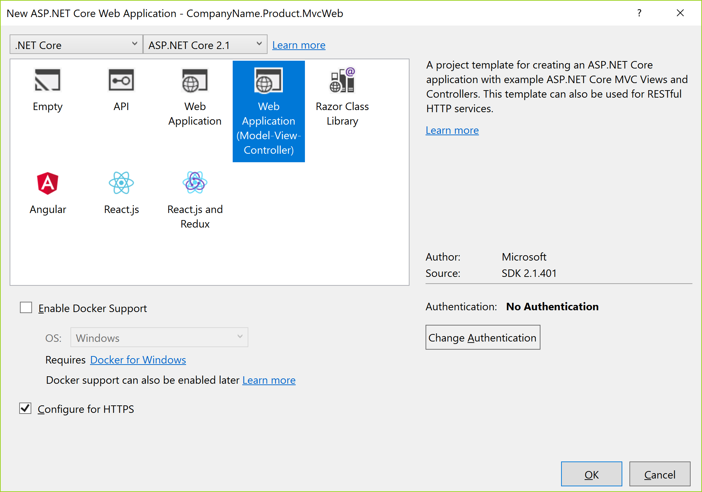

THIS project uses out of date references. The concepts are still valid in May 2021, but some details have changed.  The Nexul Academy courseware is more up to date.

https://www.nexulacademy.com/courseware/

# demo-aspnet-angular
Integration Options for an Angular front-end and an ASP.Net Core MVC back-end API

Each implementation will serve MVC routes that match then angular for any other routes. Be careful not to use the same route in both an Angular page and an MVC controller action, or the one that will appear to the user will vary depending on how they navigated to the route; If by using Angular routing in an already loaded angular app, then the Angular route will be served; If by a full page refresh, then the MVC route will be shown.

The best option varies depending on the project size and team arrangement.

## System Requirements
These solutions require Node/Npm and ASP.Net Core 2.1 SDK and Visual Studio 2017 (15.7, any edition) to be installed on the developer machine.

Download node/npm here: https://nodejs.org/en/download/

Download DotNet Core SDK here: https://www.microsoft.com/net/download

Some options require the angular cli to be installed with npm.

Check if it is installed using terminal command:

    > ng -v

If the command is not recognized, then the CLI is not installed. Ensure you have at least Angular CLI version 6.

install the latest version or a fresh install when missing:

    > npm install -g @angular/cli
    
Read more about the CLI or get more help during installation:
https://github.com/angular/angular-cli/wiki

## Integration Option 1: Simple SPA with Visual Studio
The most basic option is a single Visual Studio SPA project for both the API back-end and the Angular front-end. The 'dotnet new' command that comes with DotNet Core 2.1 includes the template used by the following command.  You can also use the VS New project dialog to create the project.

    ..\solutionRoot> dotnet new angular –o simple-aspnet-spa-angular

Name the project as you wish, by changing the name after the -o option.

Find the completed code for this option in folder 'simple-aspnet-spa-angular'.

## Integration Option 2: Custom Build Tasks
MSBuild and Angular both supply extensive customizability during build. There are numerous options to integrate AspNet Core and Angular beyond what is shown in this example.

This option begins by generating the two projects to be integrated. This example will use the new  project dialog in Visual Studio to generate the first of the two projects, but you may also accomplish this in the terminal window similar to the prior option using another template.

### Step 1

### Step 2

### Step 3
The prior step created a folder for the solution. Within the solution folder, create the CLI application using the terminal 'ng new' command. Specify any typical 'ng' options you prefer.

    ..\solutionRoot\custom-build-tasks> ng new companyname-product-cli --routing

### Step 4
The Angular project build can be output to any directory, by default it is output to the 'dist' folder under the project,
and wipes all files in that folder on each build. For MVC to use the files it should be output to the 'wwwroot' folder. This change can be made in the 'angular.json' file.  The 'wwwroot' folder also contains other resources for the MVC project that should not be deleted on build. The Angular build options are set in the 'package.json'.  Change both of these as shown in the commit for step004.

### Step 5
The MVC middleware by default already looks for static files in the 'wwwroot' folder, however, Angular has many virtual routes that do not have corresponding output files. To enable loading of Angular routes, update the MVC middleware to match the commit for step 5. See the code comments for an explanation of each change.

### Step 6
The HomeController defines a route on the Index action to accept the default route. If the Angular app should load at the default route, then update the routes on the controller using attribute routing. See the commit for step 6 for details.

Find the completed code for this option in folder 'custom-build-tasks'.

## Integration Option 3: Combo SPA Application with latest Angular CLI
The combo solution includes two projects, one generated by the 'dotnet new' command included with the DotNet Core 2.1 SDK. The second requires the @angular/cli package to be installed globally with npm.

Create two projects with terminal commands:

    ..\solutionRoot> dotnet new mvc –o CompanyName.Product.MvcWeb
    ..\solutionRoot> ng new companyname-product-cli

Any version of the Angular CLI can be used, version 6.0.8 was used to generate this sample.

Then edit the MVC Startup.cs middleware and MSBuild steps in the .csproj file.

Run from Visual Studio works with and without debugging.  Debug only debugs the C# code, use Chrome to debug the Angular app. Debug will use the start task in the angular project to start it within node, and will support live reload as the Angular code is changed.

Publish from Visual Studio will run the Angular projects build task and include the output in the published content folder.

Find the completed code for this option in folder 'combo'.

